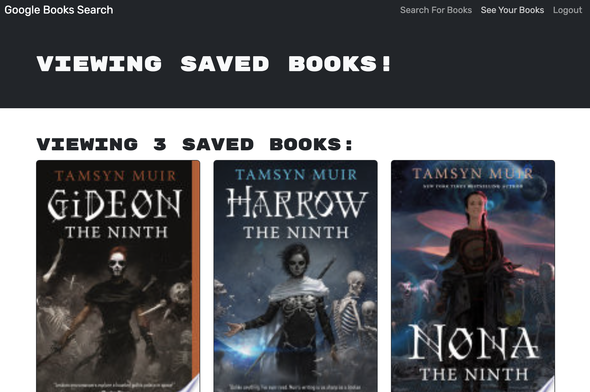

# Google Book Search

  
## Description
This application allows users to create an account where they can search for books via GoogleBooks and add them to their collection. Once the books are added to the collection, the user has the ability to delete books from the collection. This application was refactored to utilize the MERN stack with a React frontend, MongoDB database, and Node.js/Express.js server and API.

## Table of Contents
- [Application Preview](#application-preview)
- [Deployed Application](#deployed-application)
- [Questions](#questions)
- [License](#license)

## Application Preview

## Deployed Application
[Click here to view the Deployed Application on Heroku](https://agile-reef-78126.herokuapp.com/)

## Questions
Please visit my [GitHub Page](https://github.com/armaples) or [email me](mailto:raynemaples@gmail.com).
  
## License
Distributed under the MIT License. Please follow [this link](https://opensource.org/licenses/MIT) for more information, or click on the badge at the top.